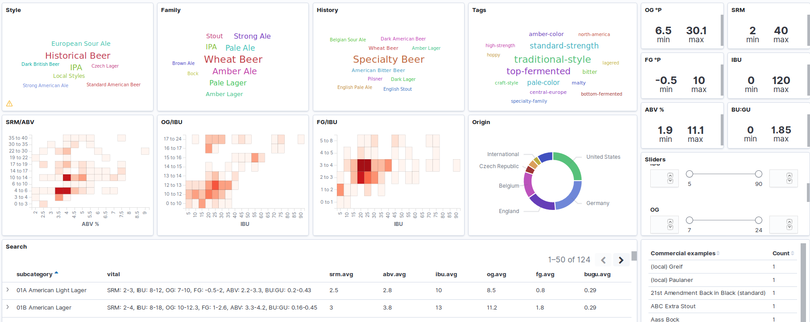
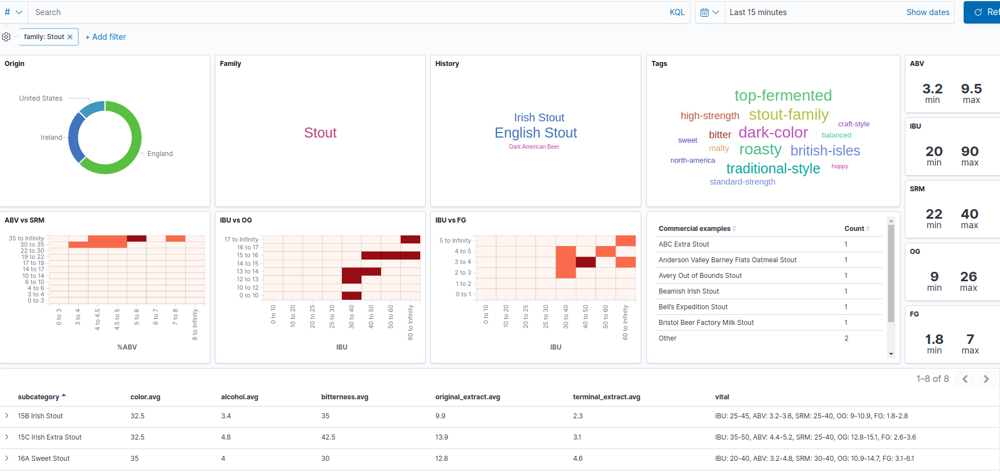
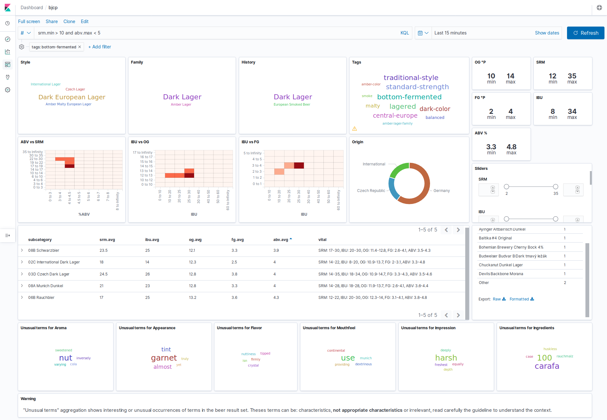
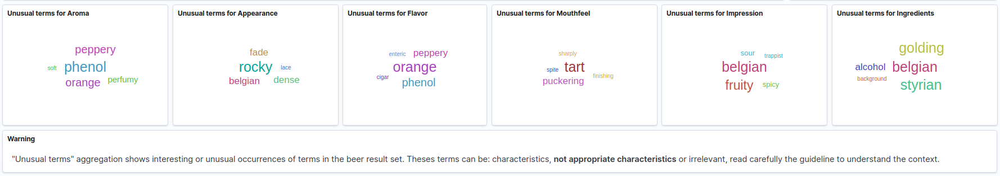

# BJCP-ELK Basic analytics on the Beer Judge Certification Program Style Guide

BJCP is the [Beer Judge Certification Program](https://bjcp.org/), that among other things produces a Beer Style Guidelines
with the following copyright:

> The BJCP grants the right to make copies of the Style Guide for use in
> BJCP-sanctioned competitions or for educational/judge training purposes.
> All other rights reserved.

This repository uses the content of the 2015 BJCP Style Guide only as a personal **educational** purpose.

The BJCP data or any derivative output are protected by the BJCP Copyright and should not be marketed for profit or integrated or embedded in websites without the BJCP agreement.

The most current version of the BCJP Style Guide can be found on the [BJCP web site](https://www.bjcp.org/).

ELK is a stack composed of [Elasticsearch](https://www.elastic.co/products/elastic-stack) and [Kibana](https://www.elastic.co/products/kibana) that provides at-a-glance insights into the Style Guide and enables you to drill down into details.

## Screenshots

The default dashboard with 124 Sub categories of beer:


Filtering on the Stout family:


Searching for a beer with citrus aroma and low bitterness:


Significant terms for Scottish beers:


## Installation

### Requirements

For now the stack and scripts are tested only on Linux and Mac OS.

You need to install: 
- [docker](https://docs.docker.com/install/)
- [docker-compose](https://docs.docker.com/compose/install/)
- curl
- bash

For Mac OS, you have to update your `/etc/hosts` and add the following lines:
```bash
127.0.0.1 elastic.docker.localhost
127.0.0.1 kibana.docker.localhost
```

### 1. Start the EK Stack

Open a terminal and run:
```bash
docker-compose up
```

The first time it will take time to download docker images, have a beer.
The stack is up when you see some output like:

```bash
elastic          | {"type": "server", "timestamp": "2019-11-08T09:06:08,264Z", "level": "INFO", "component": "o.e.c.r.a.AllocationService", "cluster.name": "docker-cluster", "node.name": "elastic", "message": "Cluster health status changed from [YELLOW] to [GREEN] (reason: [shards started [[.kibana_1][0]]]).", "cluster.uuid": "76sBrZV1SXuR6CyjlGsFZQ", "node.id": "DK5p_IskRhuPpoWUmfm9Qg"  }
...
kibana           | {"type":"log","@timestamp":"2019-11-08T09:06:08Z","tags":["info","http","server","Kibana"],"pid":7,"message":"http server running at http://0:5601"
```

### 2. Import the BJCP Style Guide and Kibana Dashboard

When the stack is started, run the `install.sh` script: 

```bash
./install.sh
```
You should have:
```bash
...
### Elasticsearch index bjcp provisionned successfully
### Importing BJCP Kibana dashboard
### Success, visit: http://kibana.docker.localhost
```
      
## Usage

Once the installation is done you have access to the `bjcp` Dashboard:
- http://kibana.docker.localhost/app/kibana#/dashboards

### Searching and filtering

You can enter search query in KQL ([Kibana Query Language](https://www.elastic.co/guide/en/kibana/7.4/kuery-query.html)).

Here are some examples:
- Search for subcategories:
  - ```id: 7B```
  - ```id: 22A```
- Search for a style:
  - ```style: "07"```
  - ```style: "17"```
- Fulltext search on `subcategory`:
  - ```subcategory.fulltext: lager```
- Fulltext search on `aroma`, `appearance`, `flavor`, `mouthfeel` or `overall_impression` fields:
  - ```flavor: burnt```
  - ```aroma: resinous```
- Fulltext search on all fields:
  - ```Ch'Ti```


You can use sliders to filter SRM, IBU, OG or ABV range.

You can filter using any selectable cloud tags.

The significant terms cloud are the unusual terms used for the selected beers (the result list) compared to the entire Guide.

### Stop and restart the stack

You need to run the `docker-compose` command from the directory
The docker compose stack can be stop:
```bash
docker-compose down --volume
```

And restart:
```bash
docker-compose up -d
```

The Dashboard is persisted on the `./data` directory so you can customize the dashboard.

## Dev

### About the data

The 2015 BJCP Style Guide has been turned into a JSON version along with the following metadata:

- `origin`: as described in [Styles Sorted Using Country of Origin](https://dev.bjcp.org/beer-styles/4-styles-sorted-using-country-of-origin/)
- `family`: as described in [Styles Sorted Using Style Family](https://dev.bjcp.org/beer-styles/3-styles-sorted-using-style-family/)
- `family_history`: as described in [Styles Sorted Using History](https://dev.bjcp.org/beer-styles/5-styles-sorted-using-history/) 


The original and terminal extract are in Plato instead of SG. 


For now only the subcategories are injected into Elasticsearch, some fields are added:

- vital statistics averages: `abv.avg`, `og.avg`, `fg.avg`, `ibu.avg`, `srm.avg`
- subcategory names are prefixed with identifier formatted in sortable way (i.e `1A` is rewritten as `01A`)

 
### Extract data from JSON to Elasticsearch bulk format

Run the python script to generate the `bjcp-es.json` file: 
```bash    
./extract.py > ./bjcp-es.json
```

Note that if you want the gravity in SG instead of Plato you can edit the `extract.py` file and set:
```python
USE_SG = True
```

### Export/import the Kibana dashboard

Use the following scripts to export or import your Kibana dashboard:

```bash
./export-dashboard.sh
./import-dashboard.sh
```
