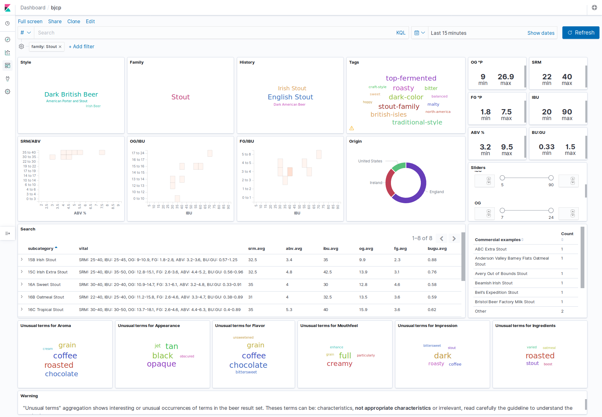

# BJCP-ELK Basic analytics on the Beer Judge Certification Program Style Guide

BJCP is the [Beer Judge Certification Program](https://bjcp.org/), that among other things produces a Beer Style Guidelines
with the following copyright:

> The BJCP grants the right to make copies of the Style Guide for use in
> BJCP-sanctioned competitions or for educational/judge training purposes.
> All other rights reserved.

This repository uses the content of the 2015 BJCP Style Guide only as a personal **educational** purpose.

The BJCP data or any derivative output are protected by the BJCP Copyright and should not be marketed for profit or integrated or embedded in websites without the BJCP agreement.

The most current version of the BCJP Style Guide can be found on the [BJCP web site](https://www.bjcp.org/).

ELK is a stack composed of [Elasticsearch](https://www.elastic.co/products/elastic-stack) and [Kibana](https://www.elastic.co/products/kibana) that provides at-a-glance insights into the Style Guide and enables you to drill down into details.

## Screenshots

The default dashboard with 124 Sub categories of beer:


Filtering on the Stout family:


Searching for an amber/dark lager with low alcohol:


Unusual terms for Belgian beers (See below to understand what is an Unusual term)


## Installation

### Requirements

For now the stack and scripts are tested only on Linux and Mac OS.

You need to install: 
- [docker](https://docs.docker.com/install/)
- [docker-compose](https://docs.docker.com/compose/install/)
- curl
- bash

For Mac OS, you have to update your `/etc/hosts` and add the following lines:
```bash
127.0.0.1 elastic.docker.localhost
127.0.0.1 kibana.docker.localhost
```

### 1. Start the EK Stack

Open a terminal and run:
```bash
docker-compose up
```

The first time it will take time to download docker images, have a beer.
The stack is up when you see some output like:

```bash
elastic          | {"type": "server", "timestamp": "2019-11-08T09:06:08,264Z", "level": "INFO", "component": "o.e.c.r.a.AllocationService", "cluster.name": "docker-cluster", "node.name": "elastic", "message": "Cluster health status changed from [YELLOW] to [GREEN] (reason: [shards started [[.kibana_1][0]]]).", "cluster.uuid": "76sBrZV1SXuR6CyjlGsFZQ", "node.id": "DK5p_IskRhuPpoWUmfm9Qg"  }
...
kibana           | {"type":"log","@timestamp":"2019-11-08T09:06:08Z","tags":["info","http","server","Kibana"],"pid":7,"message":"http server running at http://0:5601"
```

### 2. Import the BJCP Style Guide and Kibana Dashboard

When the stack is started, run the `install.sh` script: 

```bash
./install.sh
```
You should have:
```bash
...
### Elasticsearch index bjcp provisionned successfully
### Importing BJCP Kibana dashboard
### Success, visit: http://kibana.docker.localhost
```
      
## Usage

Once the installation is done you have access to the `bjcp` Dashboard:
- http://kibana.docker.localhost/app/kibana#/dashboards

### Searching and filtering

You can enter search query in KQL ([Kibana Query Language](https://www.elastic.co/guide/en/kibana/7.4/kuery-query.html)).

Here are some examples:
- Search for exact style identifier
  - ```style_id: X```
  - ```style_id: 7```
- Search for style ranges
  - ```style_num <= 27```
  - ```style_num > 10 and style_num: 27```
  - ```not style: 2```
- Fulltext search on style name
  - ```style.fulltext: (porter OR stout OR brown)```
- Search for subcategories:
  - ```id: 7B```
  - ```id: 22A```
- Fulltext search on `subcategory`:
  - ```subcategory.fulltext: lager```
- Fulltext search on `aroma`, `appearance`, `flavor`, `mouthfeel` or `overall_impression` fields:
  - ```flavor: burnt```
  - ```aroma: resinous```
- Fulltext search on all fields:
  - ```Ch'Ti```


You can use sliders to filter SRM, IBU, OG, FG or ABV range.

You can filter using any selectable cloud tags.

The ["Unusual terms"](https://www.elastic.co/guide/en/elasticsearch/reference/current/search-aggregations-bucket-significantterms-aggregation.html) aggregations show interesting or unusual occurrences of terms in the beer result set.

Theses terms can be characteristics or **not appropriate** characteristics for the result set,
you need to read carefully the guideline to understand the context.

### Stop and restart the stack

You need to run the `docker-compose` command from the directory
The docker compose stack can be stop:
```bash
docker-compose down --volume
```

And restart:
```bash
docker-compose up -d
```

The Dashboard is persisted on the `./data` directory so you can customize the dashboard.

### Advanced search

Warning: this is very experimental, do not try to get any conclusion at this stage. 

Using Elasticsearch 7.4 (non oss version :/) it is possible to use `dense_vector` field type and express vital statistic as a vector.

The vital characteristics can be normalized to be in a 0-1 range using the following ranges:

|  | 0 | 1 |
| --- | ---: | ---: |
| IBU | 0 | 120 |   
| SRM | 2 | 40 |   
| OG | 6.5 | 30.1 |   
| FG | -0.5 | 10 |   
| ABV | 1.9 | 11.1 |   

For instance SRM=2 is translated into 0 and SRM 40 into 1.

Taking the statistics for `26D Belgian Dark Strong Ale` we have
- `ibu.avg`: 27.5
- `srm.avg`: 17
- `og.avg`: 22
- `fg.avg`: 4.3
- `abv.avg`: 7.9

Which can be rewrite to a normalized vector:
`[0.22916666666666666,0.39473684210526316,0.6567796610169491,0.45714285714285713,0.6521739130434783]`


Then we can use the `l2norm` function to calculate L2 distance (Euclidean distance) between the given vector and document vectors.
using this as ranking score returns the beers with similar vital characteristics: 
```
curl -s -X POST 'elastic.docker.localhost/bjcp/_search?pretty' -H 'Content-Type: application/json' -d'{
  "query": {
    "script_score": {
      "query": {
        "exists": {
          "field": "vector"
        }
      },
      "script": {
        "source": "1 / (1 + l2norm(params.query_vector, doc[\u0027vector\u0027]))",
        "params": {
          "query_vector": [0.22916666666666666,0.39473684210526316,0.6567796610169491,0.45714285714285713,0.6521739130434783]
        }
      }
    }
  },
  "size": 5,
  "_source": {
    "includes": [
      "_id",
      "vector",
      "vital_avg",
      "subcategory"
    ],
    "excludes": []
  }
}'
```
The results is something like this:

| subcategory | Vital average |
|  --- | --- |
| 26D Belgian Dark Strong Ale | SRM: 17.0, IBU: 27.5, OG: 22.0, FG: 4.3, ABV: 7.9, BU:GU: 0.3|
| 09A Doppelbock | SRM: 15.5, IBU: 21.0, OG: 21.9, FG: 5.1, ABV: 6.8, BU:GU: 0.23|
| 27A9 Sahti | SRM: 13.0, IBU: 11.0, OG: 23.1, FG: 4.6, ABV: 7.1, BU:GU: 0.11 |
| 10C Weizenbock | SRM: 15.5, IBU: 22.5, OG: 18.6, FG: 4.7, ABV: 6.2, BU:GU: 0.29|
| 22D Wheatwine| SRM: 11.5, IBU: 45.0, OG: 23.6, FG: 5.8, ABV: 7.9, BU:GU: 0.45|
 
 Which can be represented like this (Min and Max are ranges for the 26D subcategory):
 


## Dev

### About the data

The 2015 BJCP Style Guide has been turned into a JSON version along with the following metadata:

- `origin`: as described in [Styles Sorted Using Country of Origin](https://dev.bjcp.org/beer-styles/4-styles-sorted-using-country-of-origin/)
- `family`: as described in [Styles Sorted Using Style Family](https://dev.bjcp.org/beer-styles/3-styles-sorted-using-style-family/)
- `family_history`: as described in [Styles Sorted Using History](https://dev.bjcp.org/beer-styles/5-styles-sorted-using-history/) 


The original and terminal extract are in Plato instead of SG. 


For now only the subcategories are injected into Elasticsearch, some fields are added:

- vital statistics averages: `abv.avg`, `og.avg`, `fg.avg`, `ibu.avg`, `srm.avg`
- the BU:GU ratio: `bugu` which is IBU divided by the OG exprimed in gravity unit (for instance OG: 10°P = 1.040 SG = 40 GU) 
- subcategory names are prefixed with identifier formatted in sortable way (i.e `1A` is rewritten as `01A`)
- vital statistics are also stored as a normalized (value between 0 and 1) vector [srm, ibu, og, fg, abv] to help to find similarities
 
### Extract data from JSON to Elasticsearch bulk format

Run the python script to generate the `bjcp-es.json` file: 
```bash    
./extract.py > ./bjcp-es.json
```

Note that if you want the gravity in SG instead of Plato you can edit the `extract.py` file and set:
```python
USE_SG = True
```

### Export/import the Kibana dashboard

Use the following scripts to export or import your Kibana dashboard:

```bash
./export-dashboard.sh
./import-dashboard.sh
```
